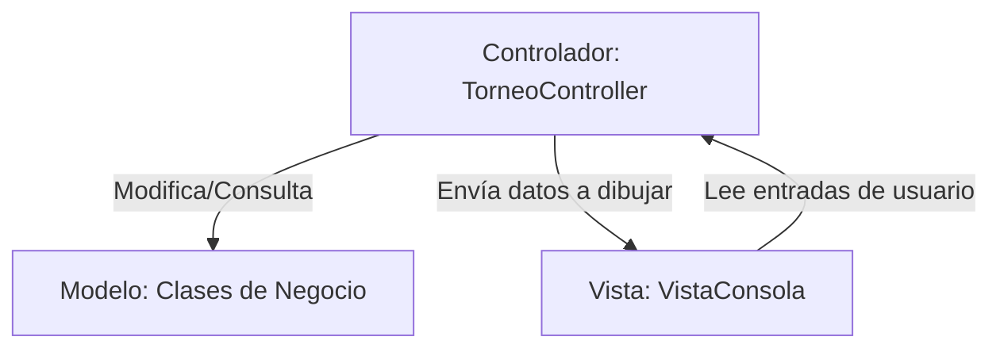

# Guía de Estudio Conceptual - EsportsManager 2026

Este documento detalla los fundamentos teóricos de la programación en Java y la ciencia de la computación aplicados en este proyecto. Ha sido diseñado específicamente para la preparación de exámenes teóricos y laboratorios del curso **IF0001 - Introducción a la Computación** de la Universidad de Costa Rica.

---

## 1. Arquitectura de Software: Modelo-Vista-Controlador (MVC)

El patrón **MVC** es una guía arquitectónica que separa la lógica del negocio de la interfaz de usuario. En este proyecto se divide de la siguiente manera:



### Reglas de Oro Aplicadas:
1.  **El Modelo no conoce a la Vista ni realiza Entrada/Salida (I/O):** Clases como `EquipoEsports` o `TorneoEsports` no contienen `System.out.println` ni importan `java.util.Scanner`. Esto permite que la lógica matemática del simulador pueda reutilizarse en una interfaz web o móvil en el futuro sin modificar una sola línea de código del modelo.
2.  **La Vista no tiene estado persistente de negocio:** Solo se encarga de dar formato estético (colores ANSI, tablas con `printf`) y capturar la información del teclado de manera segura.
3.  **El Controlador coordina:** Recibe las órdenes del usuario, invoca los algoritmos del modelo y decide qué pantalla debe renderizar la vista.

---

## 2. Relaciones entre Clases en la Programación Orientada a Objetos (POO)

En Java, los objetos se relacionan mediante enlaces de distinta fuerza. El proyecto ilustra de manera didáctica tres tipos de asociaciones:

### A. Composición Fuerte (Fuerte Acoplamiento)
*   **Definición:** El objeto contenedor gestiona el ciclo de vida de los objetos que contiene. Si el contenedor se destruye, los contenidos también.
*   **En el Proyecto:** En [EquipoEsports.java](file:///c:/Users/jonat/OneDrive/Documentos/IF0001_I_2025/Project_help/src/cr/ac/ucr/if0001/model/EquipoEsports.java), el constructor crea directamente los objetos de tipo `Jugador` usando la palabra reservada `new` internamente.
*   **Código:**
    ```java
    // Los jugadores se instancian en el constructor del Equipo
    this.players[0] = new JugadorOfensivo("Ofensivo-" + name, 75, 12.5);
    ```

### B. Agregación (Débil Acoplamiento)
*   **Definición:** El contenedor almacena referencias de objetos independientes. Si el contenedor se destruye, los objetos agregados siguen existiendo fuera de él.
*   **En el Proyecto:** Un [TorneoEsports.java](file:///c:/Users/jonat/OneDrive/Documentos/IF0001_I_2025/Project_help/src/cr/ac/ucr/if0001/model/TorneoEsports.java) agrega objetos de tipo `EquipoEsports` que ya fueron creados previamente en otro lugar.
*   **Código:**
    ```java
    // El torneo se crea vacío y recibe equipos ya instanciados
    public void registrarEquipo(EquipoEsports equipo) { ... }
    ```

### C. Asociación Débil
*   **Definición:** Relación de uso temporal donde un objeto utiliza temporalmente a otro mediante parámetros de métodos.
*   **En el Proyecto:** La clase [PartidaEsports.java](file:///c:/Users/jonat/OneDrive/Documentos/IF0001_I_2025/Project_help/src/cr/ac/ucr/if0001/model/PartidaEsports.java) asocia de forma transitoria a dos equipos (`homeTeam` y `awayTeam`) para ejecutar la simulación de un partido.

---

## 3. Manejo de Memoria RAM: Copias Defensivas

En Java, los objetos y arreglos se manipulan mediante **referencias** (direcciones de memoria RAM). Si un método accesor (`getter`) retorna directamente un arreglo interno, una clase externa podría modificar los elementos del arreglo sin pasar por las validaciones de la clase propietaria, rompiendo el **encapsulamiento**.

### Solución: Copias Defensivas
Para evitar la fuga de referencias, el código clona o copia los arreglos antes de entregarlos al exterior:

```java
// En TorneoEsports.java
public EquipoEsports[] getTeams() {
    // Retorna una copia física (shallow copy) del arreglo original en memoria
    return Arrays.copyOf(this.teams, this.teamCount);
}
```
*   **¿Por qué?** Si alguien desde fuera altera el arreglo retornado, solo estará modificando la copia superficial, y la lista real de equipos del torneo se mantendrá intacta y segura.

---

## 4. Estructuras de Datos y Algoritmos Fundamentales

### A. Matrices Bidimensionales y la Diagonal Principal
El proyecto representa los resultados cruzados de los partidos mediante una matriz cuadrada de enteros `int[][] scoresMatrix`.
*   Un concepto evaluado frecuentemente en el curso es la **Diagonal Principal** (donde el índice de la fila es igual al índice de la columna, `i == j`).
*   En la diagonal principal de este torneo, los valores siempre son `0` debido a que un equipo no puede jugar contra sí mismo.

```text
Matriz de Resultados:
                 [Equipo 0]  [Equipo 1]  [Equipo 2]
    [Equipo 0]       0           3           1      <-- La diagonal principal
    [Equipo 1]       2           0           2          siempre es (0,0), (1,1)...
    [Equipo 2]       0           4           0
```

### B. Algoritmo de Ordenamiento Manual: Bubble Sort
En lugar de utilizar métodos de biblioteca preestablecidos (`Arrays.sort()`), el proyecto implementa un algoritmo manual de ordenamiento burbuja recursivo por iteraciones, enseñando la lógica de intercambios basada en una variable temporal (`temp`):

```java
// Lógica de intercambio (Swap)
EquipoEsports temp = tempTeams[j];
tempTeams[j] = tempTeams[j + 1];
tempTeams[j + 1] = temp;
```

Además, implementa **desempates en cascada**:
```java
if (puntosA < puntosB) {
    intercambiar = true;
} else if (puntosA == puntosB) {
    if (victoriasA < victoriasB) {
        intercambiar = true;
    } else if (victoriasA == victoriasB) {
        if (habilidadA < habilidadB) {
            intercambiar = true;
        }
    }
}
```

---

## 5. Excepciones y Robustez

Java maneja situaciones de error mediante excepciones. El proyecto diferencia dos aplicaciones clave:
1.  **Excepciones de Entrada de Datos (Checked/Unchecked I/O):** Al capturar datos con `Scanner`, si el usuario escribe una letra en lugar de un número, se lanza `InputMismatchException`. El controlador captura esta excepción mediante un bloque `try-catch`, limpia el buffer del teclado (`scanner.nextLine()`) y le solicita de nuevo el dato al usuario de manera amigable.
2.  **Validaciones de Lógica de Negocio:** Mediante el lanzamiento explícito de `IllegalArgumentException` si se pasan parámetros incorrectos a un método (como un valor negativo en los puntos de habilidad).
